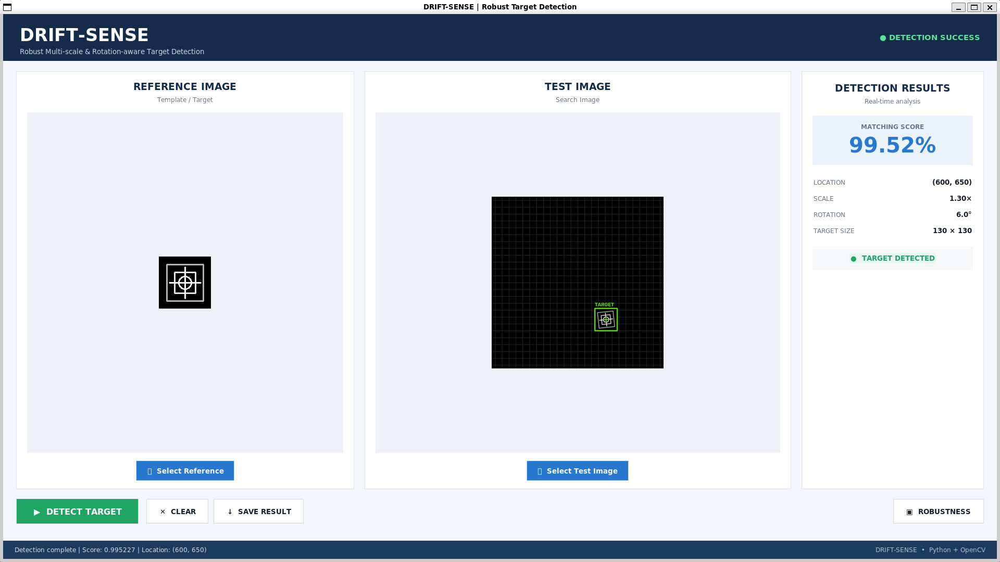

# DRIFT-SENSE


## Robust Multi-scale and Rotation-aware Template Detection

DRIFT-SENSE is an image detection system designed to locate a reference target in a larger test image under changes in scale, rotation, noise, brightness, and blur.

The project compares conventional template matching with a proposed multi-scale and rotation-aware detection approach.

---

## 1. Objective

The main objective of DRIFT-SENSE is to improve target localization when the target undergoes geometric and image distortions.

The proposed method estimates:

- Target location
- Target scale
- Target rotation
- Matching confidence

---

## 2. Proposed Method

The proposed detection approach uses:

**Multi-scale + Rotation-aware Template Matching**

Instead of searching for only the original template, the detector evaluates transformed versions of the reference template across different scales and rotation angles.

The best matching candidate is selected based on the matching score.

---

## 3. Project Structure

```text
DRIFT-SENSE/
│
├── data/
│   ├── reference/
│   │   └── reference.png
│   │
│   └── test/
│       ├── test_001.png
│       └── ground_truth_001.json
│
├── src/
│   ├── detector.py
│   ├── test_detector.py
│   ├── generate_dataset.py
│   ├── run_detection.py
│   ├── save_detection.py
│   ├── robustness_test.py
│   ├── generate_graphs.py
│   ├── method_comparison.py
│   └── final_summary.py
│
├── results/
│   ├── detection_result.json
│   ├── robustness_results_corrected.csv
│   └── method_comparison.csv
│
├── figures/
│   ├── robustness_matching_score.png
│   ├── robustness_localization_error.png
│   ├── robustness_detection_time.png
│   ├── scale_estimation_error.png
│   ├── rotation_estimation_error.png
│   ├── final_method_matching_score.png
│   └── final_method_localization_error.png
│
├── main.py
├── requirements.txt
└── README.md
